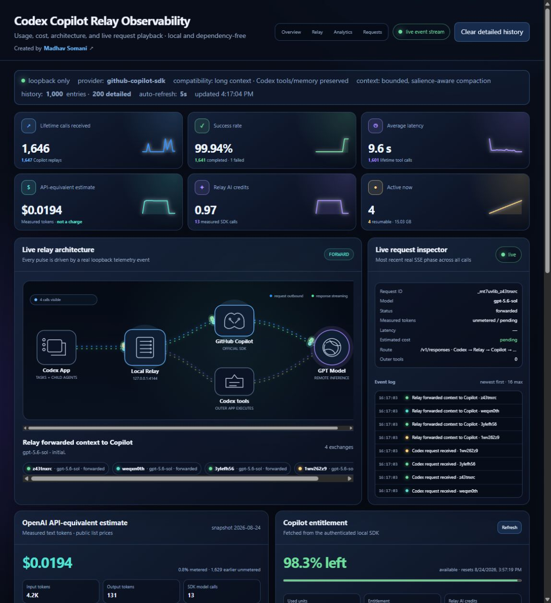
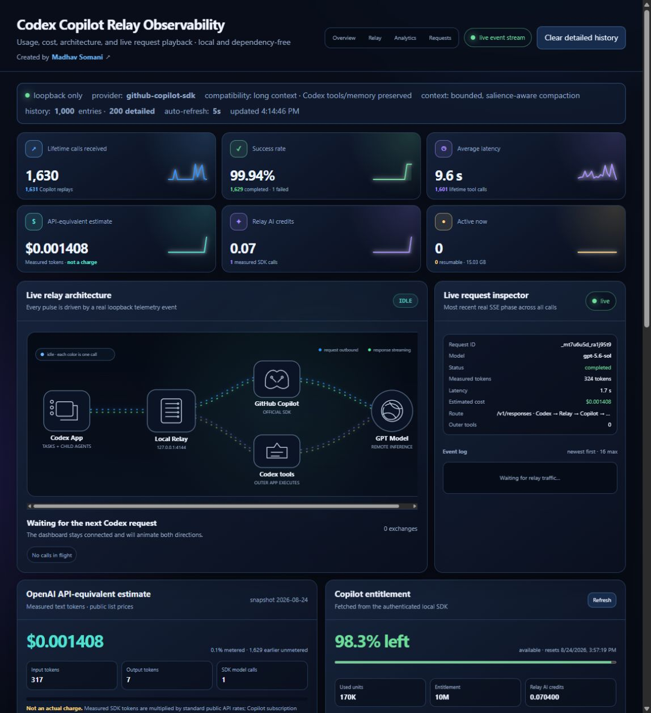
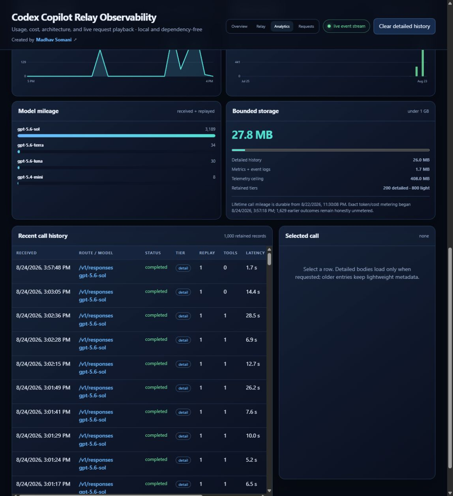
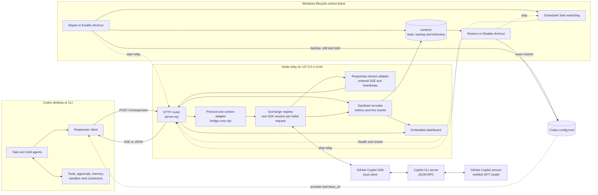
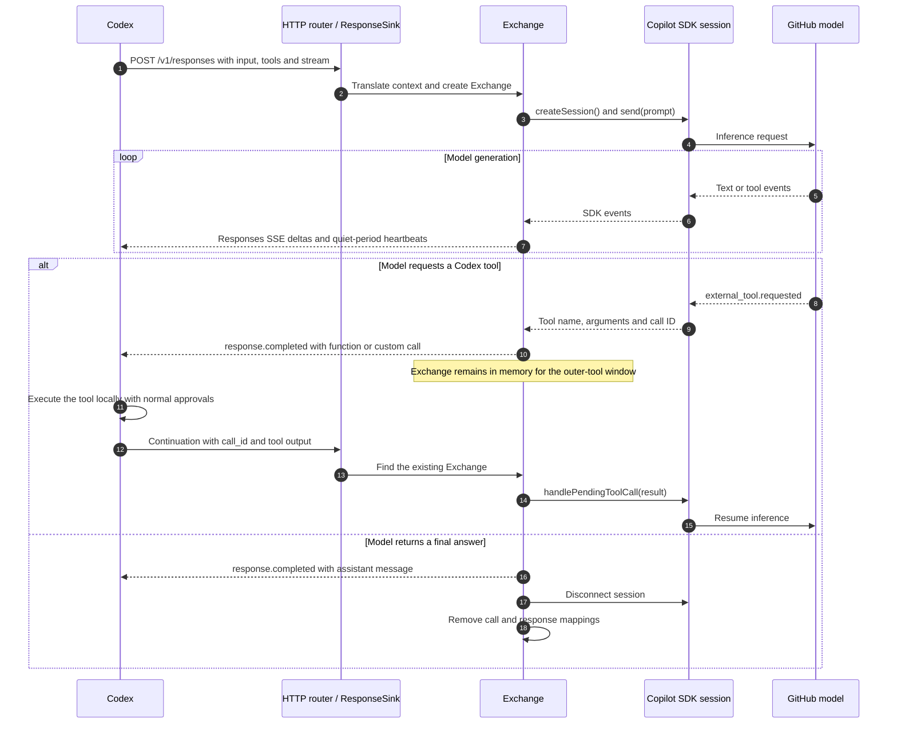

<div align="center">

# Codex Copilot Relay

**Keep the Codex experience. Route model inference through your GitHub Copilot entitlement.**

An unofficial, localhost-only OpenAI Responses compatibility gateway between
Codex and the official GitHub Copilot SDK.

[](https://github.com/madhavsomani/codex-copilot-relay/actions/workflows/ci.yml)
[](https://nodejs.org/)
[](#windows-complete-setup)
[](#security-model)
[](LICENSE)

[Quick start](#quick-start-windows) · [Live dashboard](#dashboard-preview) · [How it works](#how-it-works) · [Restore Codex](#restore-normal-codex) · [Security](#security-model)

</div>



<p align="center"><sub>A real four-request concurrency run captured from the dependency-free local dashboard. No mock traffic or fabricated metrics.</sub></p>

## Keep Codex. Change the inference path.

Codex Copilot Relay makes GitHub Copilot look like a custom OpenAI
Responses-compatible provider to Codex. The desktop app and CLI keep their
normal tools, approvals, memory, child agents, streaming, and continuation
loop; the relay translates model traffic to and from GitHub's official Copilot
SDK.

| Codex keeps owning | The relay handles | You gain |
| --- | --- | --- |
| Tools, files, approvals, sandboxing, memory, and agent orchestration | Responses protocol translation, Copilot sessions, streaming, recovery, and telemetry | A reversible Copilot-backed Codex route with live local observability |

- **Local by design:** the server and dashboard bind only to `127.0.0.1`.
- **Built for overlapping agents:** each initial request receives an independent
  Copilot SDK session.
- **Made for long tool loops:** SSE heartbeats, bounded recovery, context
  compaction, and a 13-hour outer-tool continuation window protect legitimate
  long-running work.
- **Observable without a cloud dashboard:** inspect live request flow, outcomes,
  models, sanitized history, usage, quota, storage, and API-equivalent estimates.
- **Reversible on Windows:** one shortcut enables or repairs the gateway; a
  second shortcut stops it and restores the exact original `config.toml`.

> [!IMPORTANT]
> This is not an unlimited-token route, an authentication bypass, or an
> official Codex/GitHub integration. Every model call uses the signed-in user's
> GitHub Copilot entitlement and remains subject to GitHub quota, billing,
> acceptable-use, and product terms.

## Quick start (Windows)

```powershell
npm install -g @github/copilot
copilot login

git clone https://github.com/madhavsomani/codex-copilot-relay.git
cd codex-copilot-relay
npm ci
npm run probe -- --model gpt-5.6-sol

Set-ExecutionPolicy -Scope Process Bypass
.\Repair-Codex-CopilotProxy.ps1 -Port 4144 -Model gpt-5.6-sol
```

Reopen the Codex task after the provider switch, then visit
<http://127.0.0.1:4144/dashboard>. If the probe lists a different available GPT
model, use that model ID consistently. The [complete Windows setup](#windows-complete-setup)
explains authentication, verification, shortcuts, updating, and rollback.

## Dashboard preview

The dashboard is served by the relay itself: no framework, analytics service,
CDN, or external database is required. All displayed traffic is sanitized local
telemetry.

<table>
  <tr>
    <td width="50%"></td>
    <td width="50%"></td>
  </tr>
  <tr>
    <td align="center"><sub>Overview, entitlement, pricing reference, and live request inspector</sub></td>
    <td align="center"><sub>Traffic history, model mileage, bounded storage, and recent calls</sub></td>
  </tr>
</table>

## How it works

Codex remains the agent runtime. It owns tasks, child agents, tools, approvals,
memory, files, connectors, and sandboxing. The relay is a stateful protocol
adapter plus a Windows lifecycle supervisor.

### Component architecture



### Tool-call continuation lifecycle



The relay translates request, response, streaming-event, and tool-call
envelopes. At the OpenAI Responses protocol boundary, it is designed to be a
transparent Codex provider. Codex keeps ownership of local tool execution,
sandboxing, and approvals. When a model asks for a tool, the relay returns that
request to Codex; Codex runs the tool locally and sends the result back through
the same open exchange.

## Why it exists

Codex supports custom providers that speak the OpenAI Responses protocol. The
[GitHub Copilot SDK](https://github.com/github/copilot-sdk) is a generally
available, semantically versioned SDK for building applications on top of the
Copilot agent runtime. Codex Copilot Relay adapts those two interfaces locally.

The relay itself remains an unofficial, experimental compatibility layer.
Neither GitHub nor OpenAI documents this exact cross-product setup, so protocol
or product changes can require updates to the relay.

## Features

- OpenAI Responses-compatible `/v1/responses` endpoint
- Official `@github/copilot-sdk` backend
- Independent SDK session per request for overlapping Codex agents
- Codex child-agent delegation adapter, including OpenAI-only encrypted-schema hints
- Tool-call and tool-result continuation
- Responses shorthand string input plus role-ordered structured input
- Full streaming Responses lifecycle with ordered sequence numbers and terminal
  `response.completed` or `response.failed` events
- Assistant `commentary` / `final_answer` phases, readable reasoning-summary
  events when Copilot emits them, and incremental function/custom-tool inputs
- `auto`, `none`, `required`, and named function/custom `tool_choice` handling
- Portable strict/deferred/output-schema tool metadata and Copilot-native lazy
  tool discovery for Codex declarations marked `defer_loading`
- Early HTTP 400 errors for request controls the Copilot route cannot honestly
  honor, instead of silently ignoring them
- Automatic recovery from empty Copilot completions with a bounded per-turn retry limit
- Automatic recovery when a model emits only a future-tense progress update
  instead of taking the next available tool action
- Separate sliding model timeout and 13-hour outer-tool result window, plus SSE
  heartbeats, for all-day Codex runs
- Copilot SDK session idling disabled and automatic context compaction enabled
- Model-advertised long-context tier selected explicitly when the authenticated
  Copilot model exposes it
- Outer Codex developer instructions, task memory, roles, reasoning effort, and
  tool schemas remain the source of truth; duplicate Copilot-native memory,
  built-ins, config discovery, and custom instructions stay disabled
- Historical tool images travel as image attachments instead of base64 prompt text
- Oversized historical text tool results are bounded with head and tail context preserved
- Aggregate history is compacted against the selected model's advertised prompt
  token budget into a bounded, salience-aware continuity ledger
  that prioritizes user corrections, failures, tool inputs/results, and the latest
  tool chain; the legacy character ceiling is used only if no token limit is available
- A bounded 128 MiB request envelope lets media-heavy Codex history reach the
  compactor instead of failing at the old 32 MiB HTTP-reader ceiling
- Streaming failures end with a standard `response.failed` event instead of a silent disconnect
- Loopback-only listener on `127.0.0.1`
- Modern loopback dashboard with a real-time dotted Codex → relay → Copilot →
  model network where concurrent calls keep separate colors and lanes, a
  six-card real-data KPI strip, a bounded live request inspector, 1,000 recent
  call entries, 200 on-demand sanitized detail bodies, durable lifetime mileage,
  and hourly/daily/model charts
- Exact per-call Copilot SDK input, output, cache, reasoning, AI-credit, model-
  cost-unit, and model-call telemetry when the runtime emits `assistant.usage`
- Authenticated Copilot entitlement/quota snapshots with no token, login, or
  account identifier exposed to the browser
- Separately labeled OpenAI API-equivalent cost estimates from source-dated
  public standard text-token prices; estimates are never presented as charges
- Visible Windows Terminal event stream
- Watchdog recovery for both the relay and visible terminal
- Two-click enable/restore workflow for Codex `config.toml`
- SHA-256-verified, current-user-only full-config backup

## Requirements

- [Node.js](https://nodejs.org/en/download) 20.19+ or 22.12+ (Node 22 LTS is recommended)
- Git
- A GitHub account with a Copilot plan; organization-managed accounts also need
  the Copilot CLI policy enabled
- A GPT model exposed to that account by GitHub Copilot
- Codex desktop or CLI with custom Responses-provider support

The durable shortcuts, watchdog, automatic `config.toml` backup, and exact
restore are Windows 10/11 features. The Node relay itself can be started
manually on macOS or Linux; see [Manual cross-platform setup](#manual-cross-platform-setup).

The Windows scripts honor `CODEX_HOME`. When it is set, they manage
`$env:CODEX_HOME\config.toml`; otherwise they use
`$env:USERPROFILE\.codex\config.toml`. The exact resolved path is recorded in
the protected restore state, so disabling the relay restores the same file even
if a repair process starts with a different environment later.

## Windows: complete setup

### 1. Install and authenticate GitHub Copilot CLI

GitHub's current cross-platform installation requires Node.js 22 or later:

```powershell
npm install -g @github/copilot
copilot login
copilot --version
```

Follow the browser device-login flow. The OAuth credential is stored by
Copilot CLI in Windows Credential Manager; this project does not copy it into
the relay folder. GitHub CLI authentication (`gh auth login`) is also supported
as a lower-priority fallback.

Official references:

- [Install and start GitHub Copilot CLI](https://docs.github.com/en/copilot/how-tos/copilot-cli/cli-getting-started)
- [Authenticate GitHub Copilot CLI](https://docs.github.com/en/copilot/how-tos/copilot-cli/set-up-copilot-cli/authenticate-copilot-cli)
- [How Copilot SDK authentication works](https://docs.github.com/en/copilot/how-tos/copilot-sdk/auth/authenticate)

### 2. Clone and install the relay

```powershell
git clone https://github.com/madhavsomani/codex-copilot-relay.git
cd codex-copilot-relay
npm ci
```

The official Node SDK bundles its compatible Copilot CLI runtime. Installing the
global CLI above gives users the supported login command and writes the shared
signed-in identity that the SDK uses.

### 3. Verify authentication and model access

```powershell
npm run probe -- --model gpt-5.6-sol
```

The command prints model metadata and exits successfully when the signed-in
account exposes that model. If it reports a list of other GPT models, use one
of those model IDs consistently in the commands below. Windows launchers accept
safe model IDs instead of maintaining a small hard-coded model allowlist, so a
new SDK-exposed GPT model does not require a script update.

### 4. Enable the durable gateway

Open PowerShell in the cloned folder. Administrator privileges are not needed.

```powershell
Set-ExecutionPolicy -Scope Process Bypass
.\Repair-Codex-CopilotProxy.ps1 -Port 4144 -Model gpt-5.6-sol
```

This command:

1. Saves the complete normal Codex configuration to a protected local backup.
2. Adds a managed `github_copilot_bridge` custom-provider block.
3. Starts the loopback relay and validates health.
4. Installs a per-user Scheduled Task watchdog.
5. Starts a visible Windows Terminal event stream.
6. Installs **Start or Repair Codex Copilot Bridge** and
   **Restore Normal Codex (Disable Copilot Bridge)** on the Desktop.

The managed provider includes these reliability controls:

```toml
request_max_retries = 0
stream_max_retries = 3
stream_idle_timeout_ms = 900000
```

The relay emits a valid sequenced `response.in_progress` SSE event every 15
seconds during quiet model work. The 15-minute Codex idle timeout is a safety
net, not the normal keepalive mechanism. Bounded stream retries handle a
dropped loopback stream without creating an unbounded retry loop.

### 5. Reopen Codex and verify routing

Close and reopen the Codex task after switching providers so the app server
reloads `config.toml`, then run:

```powershell
Invoke-RestMethod http://127.0.0.1:4144/health
npm run probe:stream -- --url http://127.0.0.1:4144/v1 --model gpt-5.6-sol
npm run probe:concurrency -- --url http://127.0.0.1:4144/v1 --count 4 --model gpt-5.6-sol
```

Open <http://127.0.0.1:4144/dashboard> to inspect sanitized local request and
tool-call activity, lifetime traffic mileage, model usage, outcomes, and bounded
disk use. A healthy relay reports `sseHeartbeatFormat` as
`response.in_progress`, reports its telemetry policy, and accepts concurrent
exchanges.

### Update an existing relay checkout

The Node process loads the bridge and dashboard modules at startup. After a
`git pull`, restart the relay to activate a newer dashboard or server build;
refreshing the browser alone cannot load code that the old process never read.
The **Start or Repair Codex Copilot Bridge** Desktop shortcut compares the
running `/health` version with `package.json`. It refuses to interrupt active
exchanges and, after three consecutive idle checks, replaces an outdated
managed process automatically. Run the shortcut once active work reaches a
checkpoint.

The equivalent manual sequence is:

```powershell
.\Stop-Codex-CopilotWatchdog.ps1
.\Stop-Codex-CopilotGatewayConsole.ps1
.\Stop-Codex-CopilotProxy.ps1 -Port 4144
.\Repair-Codex-CopilotProxy.ps1 -Port 4144 -Model gpt-5.6-sol
```

Use the model ID already selected for that installation. These commands keep
`runtime\` telemetry and the protected normal-config backup intact. Do not
restart during an in-flight tool continuation or render; an in-memory exchange
cannot survive a process restart.

### Local-only and mobile access

Both the relay and dashboard bind to `127.0.0.1`, so they are reachable only
from the Windows computer running the bridge. A phone cannot open that
localhost address, and ordinary mobile Chat/Work does not read the desktop
Codex `config.toml` custom-provider setting.

If the ChatGPT mobile app shows **Remote** and this Windows Codex host is paired,
you can steer a [supported desktop Codex task](https://help.openai.com/en/articles/20001275/)
from the phone while the computer stays awake, online, and running Codex. The
task still executes on the Windows host, where this local relay and provider
configuration remain in effect. This is indirect remote control, not direct
mobile access to the relay or dashboard.

Do not port-forward the persistent relay: it intentionally has no bearer token
in local-only mode. The source repository can be viewed from a phone after it
is made public, but that alone does not route mobile ChatGPT through Copilot.

## Restore normal Codex

Use the Restore Desktop shortcut or run:

```powershell
.\Disable-Codex-CopilotProxy.ps1
```

Restore removes auto-recovery first, stops the watchdog, terminal, and relay,
verifies the saved backup hash, and restores the complete pre-enable
`config.toml` byte-for-byte.

Because restoration is exact, deliberate changes made to `config.toml` while
the relay is enabled are replaced by the saved baseline.

The Start/Repair shortcut can enable the relay again later. Closing only the
visible terminal does not disable it: the watchdog reopens the terminal and
keeps the relay available. The Restore shortcut is the intentional off switch.

## Manual cross-platform setup

Windows users should prefer the automated flow above. On macOS or Linux, or
when you do not want the Windows watchdog, use this manual flow.

1. Install/authenticate Copilot CLI, clone the repository, run `npm ci`, and
   verify the selected model with `npm run probe -- --model MODEL_ID`.
2. Back up `~/.codex/config.toml` somewhere private.
3. Start the relay and keep that terminal open:

   ```bash
   BRIDGE_PORT=4144 BRIDGE_DEFAULT_MODEL=gpt-5.6-sol node server.mjs
   ```

4. Update the existing top-level `model` and `model_provider` values in
   `~/.codex/config.toml`, then add the provider block once:

   ```toml
   model = "gpt-5.6-sol"
   model_provider = "github_copilot_bridge"

   [model_providers.github_copilot_bridge]
   name = "GitHub Copilot local bridge"
   base_url = "http://127.0.0.1:4144/v1"
   wire_api = "responses"
   requires_openai_auth = false
   request_max_retries = 0
   stream_max_retries = 3
   stream_idle_timeout_ms = 900000
   ```

5. Reopen the Codex task and run the health and streaming probes shown above.
6. To stop, terminate `node server.mjs` and restore the private config backup.

The provider fields are defined by Codex's official
[configuration schema](https://github.com/openai/codex/blob/main/codex-rs/core/config.schema.json).
The manual flow has no crash watchdog and cannot restore configuration
automatically.

## Dashboard and health

With the persistent relay running:

- Dashboard: <http://127.0.0.1:4144/dashboard>
- Health: <http://127.0.0.1:4144/health>

The dashboard is a local command center as well as a history viewer:

- The overview starts with six source-backed KPIs: lifetime calls, actual
  completion rate, measured average latency, API-equivalent estimate, Copilot
  AI-credit mileage, and currently active exchanges. Lightweight SVG sparklines
  use the existing hourly, daily, and retained-call telemetry. There are no
  fabricated seats, users, accounts, or subscription charges.
- `/dashboard/events` is a loopback-only Server-Sent Events feed. Real request
  phases animate Codex → Local Relay → GitHub Copilot → GPT Model, then the
  return stream animates back to Codex. Each simultaneous call receives a stable
  color/lane and its own SVG packet; tool calls branch through outer Codex. The
  dependency-free renderer uses no per-frame JavaScript, honors reduced-motion,
  and bounds itself to 64 visible calls and 96 transient packets.
- A live request inspector shows the latest real call ID, model, phase, measured
  usage, latency, API-equivalent estimate, route, and outer-tool count. Its
  newest-first event log is capped at 16 rows in memory, even when many calls
  stream concurrently.
- GitHub's SDK `assistant.usage` events provide exact per-model input, output,
  cache-read, cache-write, reasoning, nano-AIU, and model-cost-unit metrics. The
  relay stores only the safe numeric aggregate, never provider tracing IDs.
- GitHub's SDK `account.getQuota` supplies `chat`, `completions`, and
  `premium_interactions` entitlement snapshots. Refresh is fail-soft and never
  blocks model traffic. The SDK does not expose the user's subscription purchase
  price, so the dashboard does not invent one.
- The **OpenAI API-equivalent estimate** multiplies measured per-call text tokens
  by a source-dated snapshot of OpenAI's standard public list prices. Cached input,
  GPT-5.6 cache writes, and documented >272K long-context multipliers are applied
  per model call. It excludes tool charges, regional/service-tier differences,
  taxes, and any unmetered calls, and is explicitly **not an OpenAI charge, a
  GitHub charge, savings, or a Copilot invoice**.

The persistent launcher always pins telemetry to the repository's ignored
`runtime` directory, regardless of the shell's inherited environment. Before a
stopped relay starts, it creates and validates a local telemetry snapshot under
`runtime/telemetry-backups`; the newest eight launcher-managed snapshots are
retained within a 512 MiB managed-backup ceiling, keeping the configured live
telemetry plus managed recovery points below 1 GiB. At least the newest valid
snapshot survives even if it alone exceeds that ceiling. Manually created
backup folders are never pruned. These snapshots can contain sanitized request
and response bodies, so keep them local and do not commit or share them.

To create an additional recovery point without restarting the relay:

```powershell
.\Backup-Codex-CopilotTelemetry.ps1 -Reason before-upgrade
```

Alternate-port development servers must set a separate
`BRIDGE_RUNTIME_DIRECTORY`. Never point two running relay processes at the same
telemetry directory.

Official metric and price references:

- [GitHub Copilot SDK usage and billing metrics](https://docs.github.com/en/copilot/how-tos/copilot-sdk/features/usage-and-billing)
- [GPT-5.6 Sol public API pricing](https://developers.openai.com/api/docs/models/gpt-5.6-sol)
- [GPT-5.6 Luna public API pricing](https://developers.openai.com/api/docs/models/gpt-5.6-luna)
- The remaining model-specific links are visible beside each rate in the dashboard.

The dashboard uses two storage tiers by default:

- The newest 200 calls retain bounded, sanitized request/replay/output detail.
- The remaining 800 recent calls retain only small metadata records.
- Lifetime received, replayed, completed, failed, tool, byte, and latency
  counters live in a separate atomic metrics file and never decrease when old
  detail is compacted or when **Clear detailed history** is used.
- Exact token, AI-credit, model-cost-unit, SDK-call, and API-equivalent cost
  counters share that durable metrics file and survive process restart.
- Hourly rollups cover 31 days, daily rollups cover up to 10 years, and model
  totals feed dependency-free SVG/CSS charts.
- The dashboard API returns lightweight indexes; a detailed body is fetched
  only when a recent detailed row is selected.

On the first upgrade from an older relay, the call odometer is preserved. Older
outcomes are labeled **unmetered** because their exact SDK token events no longer
exist; the dashboard shows a forward-only metering coverage percentage instead
of estimating old prompts from bytes. Exact token/cost mileage is durable from
the version-2 metrics migration forward.

Default managed storage ceilings are 256 MiB for recent history, 16 MiB for
lifetime metrics, 64 MiB for the visible event stream, 8 MiB for watchdog
events, and 32 MiB each for auxiliary stdout/stderr. That is roughly 408 MiB,
comfortably below the requested 1 GiB budget. Oversized detailed records are
bounded first, then older bodies are downgraded to metadata before any recent
metadata would need to be dropped. The persistent launcher sets these defaults;
advanced manual users can override `BRIDGE_HISTORY_LIMIT`,
`BRIDGE_DETAILED_HISTORY_LIMIT`, `BRIDGE_HISTORY_MAX_MIB`,
`BRIDGE_METRICS_MAX_MIB`, `BRIDGE_HISTORY_RECORD_MAX_KIB`, and
`BRIDGE_EVENT_LOG_MAX_MIB` within the hard server clamps.

Credential fields and common token patterns are redacted, but you should still
treat `runtime/` as private. The entire directory is excluded from Git.

Public pricing changes over time. `pricing.mjs` records the source date and
model-specific official URLs used by the dashboard; update and retest that
snapshot when OpenAI changes a listed rate. Copilot-side token prices and quota
remain runtime SDK data and are not hard-coded as currency.

## One-shot isolated launcher

The one-shot launcher does not modify the user's normal Codex configuration:

```powershell
.\codex-copilot.cmd exec --ephemeral --skip-git-repo-check "Reply with exactly RELAY_OK"
```

It starts an authenticated temporary loopback relay, launches the bundled Codex
CLI with provider overrides, and stops the relay when Codex exits.

## Concurrency and tests

Each initial Responses request receives a separate Copilot SDK session, so
independent Codex agents can overlap instead of sharing a single serialized
session.

```powershell
npm test
.\proxy-config.test.ps1
npm run probe:codex-heartbeat
npm run probe:client-disconnect -- --url http://127.0.0.1:4144 --model gpt-5.6-sol
npm run probe:stream -- --url http://127.0.0.1:4144/v1
npm run probe:compatibility -- --url http://127.0.0.1:4144/v1 --model gpt-5.6-sol
npm run probe:concurrency -- --url http://127.0.0.1:4144/v1 --count 4 --model gpt-5.6-sol
npm run probe:tools-relay -- --url http://127.0.0.1:4144/v1 --steps 6 --model gpt-5.6-sol
npm run probe:deferred-tool -- --url http://127.0.0.1:4144/v1 --model gpt-5.6-sol
npm run probe:reasoning-phase -- --url http://127.0.0.1:4144/v1 --model gpt-5.6-sol
npm run probe:request-semantics -- --url http://127.0.0.1:4144/v1
npm run probe:tool-choice -- --url http://127.0.0.1:4144/v1 --model gpt-5.6-luna
npm run probe:premature-recovery -- --url http://127.0.0.1:4144/v1
npm run probe:delayed-tool -- --url http://127.0.0.1:4144/v1 --delay-ms 31000
npm run probe:failure-stream -- --url http://127.0.0.1:4144/v1
```

The live probes consume Copilot allowance. Unit, configuration, and
`probe:codex-heartbeat` tests do not make Copilot model calls. The heartbeat
probe runs a real Codex client against a deterministic local Responses server:
Codex has a 1-second idle timeout, receives no model text for 4 seconds, and
must remain connected through parsed heartbeat events. Together, the probes
verify ordered streaming, abandoned-client cleanup, parallel requests, a
multi-turn tool chain, root/developer/memory/tool-result fidelity, progress-only
recovery, deferred-tool discovery, phased output, explicit compatibility errors,
delayed outer-tool continuation, and a well-formed terminal failure.

The default 13-hour outer-tool result window lets a single Codex exchange wait
through a 12-hour local render, browser operation, or child-agent task. It does
not create artificial follow-up turns after Codex has genuinely completed a
task, and it cannot override GitHub account limits, model limits, outages, or
service policy. Override it with `BRIDGE_TOOL_RESULT_TIMEOUT_MS` if a different
local ceiling is required.

The watchdog recovers the gateway for new calls after a process or terminal
failure. In-memory exchanges cannot survive a relay process crash, machine
sleep/network loss, an upstream Copilot outage, quota exhaustion, or a model
context limit. Long-running work should still produce checkpoints and durable
artifacts so Codex can resume safely after any external interruption. The
[durable in-flight crash-resume design](docs/CRASH-RESUME-DESIGN.md) specifies
the idempotency and crash-injection gates required before that feature can be
enabled without risking duplicate local tool execution.

The context guard limits each historical text tool result to 64 KiB. Image count
and per-image size are taken from the selected Copilot model's advertised
capabilities. For `gpt-5.6-sol`, Copilot currently advertises one prompt image,
so the relay keeps the newest image from the latest user turn first, then an
outer instruction image, then older user/history images. It replaces omitted
image markers with an explicit explanation instead of silently showing the model
an attachment name that was not sent.
When instructions, tool schemas, and accumulated history approach 90% of the
selected model's advertised prompt-token limit, the relay preserves every outer instruction,
the latest user request, and the newest tool chain while replacing older history
with a bounded continuity ledger. That ledger gives omitted user corrections and
constraints priority and retains compact excerpts of tool inputs and results.
Image attachments referenced only by omitted history are dropped. The selected
dashboard record exposes retained/omitted entry, character, and token counts, model
compatibility limits, and the terminal reports `CONTEXT OK` when compaction occurs.

The hard rejection remains as a last resort when fixed instructions/tool schemas
or the mandatory current request and newest tool chain cannot fit under the
ceiling. Raising the limit does not increase the upstream model's context window.

The relay uses a local `o200k_base` tokenizer as a budgeting estimate because
Copilot does not expose its server-side tokenizer. A 10% reserve covers provider
wrappers and tokenizer drift. The old `BRIDGE_MAX_SERIALIZED_CONTEXT_CHARS`
limit remains an emergency fallback only for models that do not advertise a
prompt-token limit; it no longer rejects a valid long-context request merely
because its UTF-16 character count exceeds one million.

Codex resends its full task envelope before the relay can compact it. Drive,
browser, and image tools can place large base64 results in that local history, so
the relay accepts up to 128 MiB by default and then applies the separate
model-token context guard described above. The raw envelope is
never forwarded unchanged to Copilot. The effective limit is reported by
`/health` under `reliability.contextGuard`; the local HTTP envelope is reported
separately as `reliability.maxRequestBodyBytes`.

For an unusual workload, set `BRIDGE_MAX_REQUEST_BODY_BYTES` before starting the
relay. Values are clamped between 1 MiB and 512 MiB; the limit is deliberately
bounded because concurrent requests occupy local memory while JSON is parsed.
Prefer connector calls that omit unneeded base64 media, and start a fresh Codex
task if even the bounded envelope is exhausted.

## Compatibility boundary

The relay preserves the Codex-side contract: system/developer instructions,
role-ordered conversation history, function/custom/namespace tool declarations,
tool-call continuations, reasoning effort/summary configuration, assistant phase,
images within the selected model's limit, and streaming Responses lifecycle
events. Codex still loads its own
memory and skills and still executes every local/browser/connector tool. The
Copilot SDK receives those outer instructions and declaration-only tool schemas;
its own memory and built-in tools are intentionally off so they cannot conflict
with the desktop harness. The sole conditional built-in is Copilot's
`tool_search_tool`, used only to discover outer declarations that Codex explicitly
marked for deferred loading.

| Responses capability | Relay status |
|---|---|
| Text input/output, streaming, usage, phases | Supported |
| Function/custom/namespace tools and continuations | Supported; execution and approval stay in Codex |
| Parallel independent Codex agents | Supported with one Copilot SDK session per initial request |
| Reasoning effort | Forwarded to Copilot |
| Readable reasoning summary | Forwarded when Copilot emits it; the provider may return reasoning usage without summary text |
| Long context | Token-budgeted against the selected Copilot model, with salience-aware local compaction |
| Data-URL images | Supported within the selected model's advertised image limits |
| Stored Responses, Conversations, hosted prompts/tools, structured-output enforcement | Rejected explicitly; not silently emulated |
| OpenAI prompt-cache identity, encrypted reasoning state, service tier, sampling/logprobs | Provider-specific and not transferable |
| Crash recovery for an in-flight exchange | Not yet supported; watchdog recovery accepts new calls after restart |

This is a compatibility relay, not byte-for-byte identity with OpenAI's native
serving stack. Provider-side encrypted reasoning state, provider compaction,
quotas, service policy, and hosted-only tools cannot be transferred between
OpenAI and GitHub. The same model name can therefore still show small behavioral
differences even when the visible Codex contract is preserved.

## Security model

- The persistent HTTP listener is hard-coded to `127.0.0.1`.
- Copilot OAuth credentials are not copied into this repository or runtime
  state.
- Persistent mode intentionally has no bearer token because it is local-only.
- Any local process running as the user may submit a request while the relay is
  enabled and consume Copilot allowance.
- For child-agent compatibility, the relay removes the OpenAI-provider-specific
  `encrypted` annotation from the tool schema sent to Copilot and transports
  the delegation message as ordinary text on loopback. Do not expose the relay
  outside the local machine.
- `runtime/`, `node_modules/`, logs, PIDs, event history, and config backups are
  ignored and must never be committed.
- Disable the relay when it is not needed.

## Terms and project status

The [GitHub Copilot SDK](https://github.com/github/copilot-sdk) is MIT-licensed
and GitHub documents it as a programmable SDK for building Copilot-powered
applications. SDK usage requires an entitlement unless BYOK is configured, and
prompts count against the applicable Copilot quota.

Users are responsible for complying with the
[GitHub Terms of Service](https://docs.github.com/en/site-policy/github-terms/github-terms-of-service),
[additional product terms](https://docs.github.com/en/site-policy/github-terms/github-terms-for-additional-products-and-features),
and [acceptable-use policies](https://docs.github.com/en/site-policy/acceptable-use-policies/github-acceptable-use-policies).

This project is not affiliated with, endorsed by, or supported by GitHub,
Microsoft, or OpenAI. GitHub, GitHub Copilot, OpenAI, and Codex are trademarks
of their respective owners.

## Author

Created by [Madhav Somani](https://www.linkedin.com/in/madhavsomani).

## License

Codex Copilot Relay is released under the [MIT License](LICENSE).
