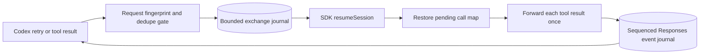

# Durable in-flight crash resume design

The watchdog already restarts the relay for new requests. It cannot currently
restore an exchange that was waiting for an outer Codex tool result when the
Node process died, because the Copilot session id, pending request ids, and
Responses event state are held in memory.

This document defines the safe path to add that capability without weakening
the current reversible config workflow or silently duplicating tool execution.

## Required contract

1. A retried Responses request with the same stable request fingerprint must
   attach to the same logical exchange, not create a second Copilot turn.
2. A tool result may be forwarded at most once for a given `call_id`.
3. Completed Responses events must be replayable in their original sequence;
   an SSE retry must never invent new output ids or sequence numbers.
4. State must remain local, access-controlled to the current Windows user, size
   bounded, versioned, and free of Copilot OAuth credentials.
5. If the SDK session cannot be resumed safely, the relay must return an
   explicit resumability error so Codex can recover from its durable artifacts.

## Proposed architecture

The durable exchange manifest should contain only:

- schema version, relay instance id, timestamps, and expiry;
- stable Copilot SDK `sessionId` and selected model/config fingerprint;
- outer response ids and a hash of the normalized request envelope;
- pending `call_id` → Copilot request/tool-call ids;
- sanitized tool metadata needed to translate the eventual result;
- last acknowledged Responses sequence number and bounded completed events;
- terminal status and tombstone expiry.

Full prompts, tool results, bearer tokens, OAuth data, and raw connector bodies
must not be added merely for crash recovery. Existing sanitized telemetry is
not an authoritative replay journal and should remain separate.

## Implementation phases

1. Add a versioned atomic journal and per-user ACL tests.
2. Mint stable session ids, enable the Copilot SDK session store, and prove a
   disconnected idle session can be resumed without a new model call.
3. Persist pending external-tool mappings before returning the tool call to
   Codex; mark results forwarded with an atomic compare-and-set operation.
4. Add request fingerprints and completed-event replay for Codex stream retries.
5. Add crash-injection probes at four boundaries: before tool publication,
   after tool publication, before result forwarding, and after model completion.
6. Enable by default only after duplicate-tool and stale-session tests pass on
   Windows reboot, process kill, and watchdog restart paths.

## Non-guarantees

Durable local state cannot make an upstream outage, quota limit, revoked
entitlement, machine sleep, or expired provider session disappear. A 12-hour
task still needs checkpointed artifacts. Crash resume improves local relay
continuity; it is not a promise that any remote model call can run forever.
