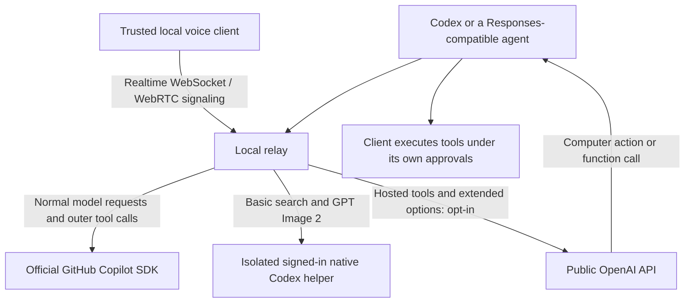

# Hybrid setup: Copilot first, explicit OpenAI fallback

Version 1.3.22 keeps the 1.3 dashboard and ordinary Copilot inference path.
It adds an **optional public OpenAI API transport**, not a subscription or
authentication bypass. It does not promise identical behavior across providers.

## Three distinct execution paths



| Capability | Path | Prerequisite |
| --- | --- | --- |
| Reasoning, coding, ordinary function tools, child-agent model turns | Copilot | Your own Copilot subscription/access and CLI login |
| Capturing a screen, local files, shell, browser, MCP | Client/harness; results interpreted by Copilot | Client supplies and executes tools |
| Basic hosted web search, built-in image tool with basic GPT Image 2 options | Existing native Codex helper | Current native Codex installation and sign-in; separate subscription allowance |
| Hosted `file_search`, `code_interpreter`, `computer_use_preview` / `computer`, Responses `image_generation` | Entire Responses turn goes to public OpenAI | Platform API key, local gateway token, supported upstream model and account access |
| Search domain/location/context options, stored/background Responses, structured outputs | Entire Responses turn goes to public OpenAI | Same public-API setup |
| Multipart image edits, masks, explicit size/quality, multiple images, other image models | Public Images API, original request preserved | Same; upstream validates actual supported combinations |
| Realtime WebSocket, WebRTC signaling, speech/transcription endpoints | Public OpenAI | Same; voice client still captures/plays audio |
| Several images sent to a one-image Copilot model | Bounded labelled contact sheet | No OpenAI key; may reduce resolution |
| Exact separate native image inputs | Explicit `openai/<model>` Responses request | Public-API setup |

Computer-use API support means **transporting action proposals and screenshots**.
It does not authorize the relay to click or execute anything, bypass safety checks,
or give a generic client Codex's browser tools. Your client implements the action
loop and preserves its approval checks. Modern OpenAI models may require
`computer` instead of the older `computer_use_preview` declaration.

## 1. Install and verify the Copilot path

Use Node.js 22 LTS (minimum 20.19), Git, and your own GitHub account with Copilot
CLI access. Organization policy and available models still apply.

```powershell
npm install -g @github/copilot
copilot login
git clone https://github.com/madhavsomani/codex-copilot-relay.git
cd codex-copilot-relay
npm ci
npm test
npm run probe -- --model gpt-6-astra
```

Use a model actually listed for your account if Astra is unavailable.
Official [Copilot CLI installation](https://docs.github.com/en/copilot/how-tos/set-up/install-copilot-cli)
and [Copilot CLI authentication](https://docs.github.com/en/copilot/how-tos/use-copilot-agents/use-copilot-cli).

For the ordinary reversible Windows setup, follow [README](../README.md).
Native search/images are optional: install current Codex, sign in using
`codex login`, then run `./Enable-Codex-NativeTools.ps1`. See
[NATIVE-TOOLS.md](NATIVE-TOOLS.md) for the tested helper version and supported options.

## 2. Understand the public-API boundary before enabling it

**A ChatGPT/Codex login is not a general OpenAI Platform API key.** The relay
never reads `auth.json`, extracts subscription tokens, or forwards incoming
Codex authentication to public APIs. Use your own
[Platform project key](https://platform.openai.com/api-keys), billing, model
access and project limits. A key may not grant every model/tool.

Enabling public fallback authorizes eligible requests, including their full
conversation/tools and uploaded files, to leave your computer for OpenAI. For
hosted tools, the **entire model turn**, not just the tool's execution, is billed
by OpenAI. No key or local token is printed, stored in TOML, or committed.

Fallback is **capability-based**, not an automatic retry after a Copilot error.
No already-submitted paid request is retried or sent to a second provider.

## 3. Windows: optional authenticated hybrid launcher

First let ongoing tasks finish. If a relay is running, use **Restore Normal
Codex** to stop it intentionally. The hybrid launcher refuses to interrupt it.
Open PowerShell in the cloned repository and run:

```powershell
Set-ExecutionPolicy -Scope Process Bypass
.\Start-Relay-With-OpenAI.ps1 -OpenAIModel gpt-6-astra
codex
```

Select an OpenAI model your Platform project supports; the parameter is an
explicit mapping for requests that otherwise named a Copilot model. The script
prompts privately for the key, generates a distinct local token, starts a hidden
child watchdog that inherits the key plus the normal backup workflow, and adds only this environment reference to
the managed provider block:

```toml
env_http_headers = { "x-relay-openai-token" = "RELAY_OPENAI_LOCAL_TOKEN" }
```

Run Codex CLI from **that PowerShell session**. For desktop, fully exit the app
and launch its executable from that same session so it inherits the token;
an already running desktop process does not acquire new environment variables.
Do not paste the actual token into TOML. Restore removes the managed header too.

Credentials are process-local. The normal reboot watchdog does not store or
recover them: repeat the optional launcher after reboot if you want paid
fallback. A normal repair without the opt-in environment returns to the
Copilot-only configuration. Keep the protected native config backup private.
After the relay/watchdog inherit the key, the launcher removes it from the
calling shell; Codex needs only the separate local token. An ordinary repair
from a shell without the key does not re-enable paid fallback.

## 4. Other platforms or agent runtimes

Windows config switching/shortcuts are Windows-specific. The Node HTTP transport
can be launched directly on other platforms with a supported Copilot SDK/CLI:

```bash
# Obtain secrets through your shell/secret manager, never as CLI arguments.
read -rs -p 'OpenAI Platform key: ' RELAY_OPENAI_API_KEY; echo
export RELAY_OPENAI_API_KEY
export RELAY_OPENAI_LOCAL_TOKEN="$(node -e "process.stdout.write(require('crypto').randomBytes(32).toString('hex'))")"
export RELAY_OPENAI_ENABLED=1
export RELAY_OPENAI_MODEL=gpt-6-astra
export BRIDGE_PORT=4144
node server.mjs
```

The client must inherit/provide the **local** token, not the upstream key. Use
base URL `http://127.0.0.1:4144/v1` and header
`x-relay-openai-token: <local token>`. Keep both processes in a trusted local
session; do not expose the listener, dashboard, key, or token on your LAN.

Any agent that supports the implemented **Responses** protocol can supply its
own function tools and execute returned calls. This is not a universal
Chat Completions adapter: clients restricted to `/chat/completions` need a
separate adapter. `/v1/models` retains Codex's catalog envelope; generic clients
should specify a known model rather than rely on public-style model discovery.

Runnable client examples: [Responses](../examples/responses-client.mjs) and
[Realtime WebSocket](../examples/realtime-client.mjs). They contain no credentials.

## 5. Routing, state and options

- Ordinary `/v1/responses` remains Copilot. Basic hosted search stays on the
  signed-in helper when enabled. Unsupported search constraints select public
  OpenAI instead of being silently ignored.
- Request `model: "openai/<actual-model-id>"` to explicitly select OpenAI. Or
  use `/v1/openai/responses` with a normal OpenAI model ID. Explicit mode also
  handles separate native image inputs and controls the Copilot path cannot.
- Hosted tool declarations automatically select public OpenAI. The fallback
  requires the opt-in, credentials and a configured native model; otherwise it
  returns an actionable error before inference. It never fabricates tool results.
- OpenAI response IDs stay on OpenAI across continuations/restarts. A bounded
  metadata file stores only hashed response IDs for 30 days/10,000 responses.
  Once metadata expires, resend full context with an explicit provider. It is
  not an OpenAI response store: `previous_response_id` still obeys OpenAI's
  storage/retention requirements, including `store: false` behavior.
- You cannot migrate a live Copilot response ID into an OpenAI continuation.
  Start a new request with complete context. Provider-encrypted reasoning is
  not transferable. Public OpenAI may reject Codex-internal request extensions;
  the gateway intentionally does not silently discard those fields.
- Image packing retains up to 12 recent images within 32 MiB of base64 before
  fitting the actual Copilot slot/byte budget. Packed panels may be downscaled;
  omitted older references are labelled in the context. Single in-budget images
  are byte-identical. For precision, request one source/crop at a time or use
  explicit public OpenAI native multi-image input.

Public routes include Responses create/retrieve/cancel/delete/input_items,
Files, vector-store files/batches/search, Containers/files, Images, Audio,
Realtime client secrets and WebRTC call signaling. Use the upstream documented
request formats. Multipart bodies and binary downloads are passed unchanged.
No arbitrary URL proxying, redirects, admin APIs, or filesystem URL fetching.

Realtime: `ws://127.0.0.1:4144/v1/realtime?model=<your-realtime-model>` with
server-side local-token header authentication. Browser origins and credential
subprotocols are rejected. A trusted backend can use `/v1/realtime/client_secrets`
or `/v1/realtime/calls` for WebRTC; media travels directly between the browser
and OpenAI, not through this HTTP gateway. Keep ephemeral credentials private.
Sessions have a 60-minute relay ceiling, 4 MiB message cap and bounded buffering.

**This does not prove Codex desktop's built-in voice button uses these endpoints.**
Its microphone, UI, native session protocol and account services are app-owned.
The Realtime gateway can be used by compatible clients; desktop voice requires
separate app integration verification. Copilot does not become a speech model.

## Verification and operational limits

```powershell
npm test
powershell -NoProfile -File .\proxy-config.test.ps1
powershell -NoProfile -File .\hybrid-config.test.ps1
node probe-suite.mjs --only probe-vision-parity.mjs
```

Unit/integration tests use local fake upstreams for public API routing,
streaming, binary data, auth, cancellation and real WebSocket framing. They
**do not establish paid API account availability or generated audio quality**.
The parity probe uses actual Copilot; `probe-vision.mjs` retains the harder
bitmap-digit regression. OCR success on arbitrary screenshots is not guaranteed.

`/health` exposes `openaiFallback.enabled`, `configured`, `activeJobs` and a
non-secret error code. Responses carry `x-relay-backend` and route-reason headers.
Public usage is **excluded from Copilot counters**; inspect OpenAI's project
usage for bills. Gateway telemetry logs only backend/reason/status, not request
bodies. A maximum of eight public jobs, 128 MiB uploads and a 15-minute inactivity
deadline bound resource use. Client disconnects cancel upstream work. Cancellation
does not undo work already performed or guarantee zero charges.

The relay must be running to proxy anything. The watchdog recovers processes;
it does not transparently switch the desktop to OpenAI when the whole relay is
down. Use Restore Normal Codex for that. No 12-hour soak or built-in desktop
voice certification is implied by the short probes.

Sources verified for this adapter:
[Codex authentication](https://developers.openai.com/codex/auth/),
[Responses tools](https://developers.openai.com/api/docs/guides/tools),
[Code Interpreter](https://developers.openai.com/api/docs/guides/tools-code-interpreter),
[computer use](https://developers.openai.com/api/docs/guides/tools-computer-use),
[image generation](https://developers.openai.com/api/docs/guides/tools-image-generation),
[Realtime WebSockets](https://developers.openai.com/api/docs/guides/voice-websockets).
